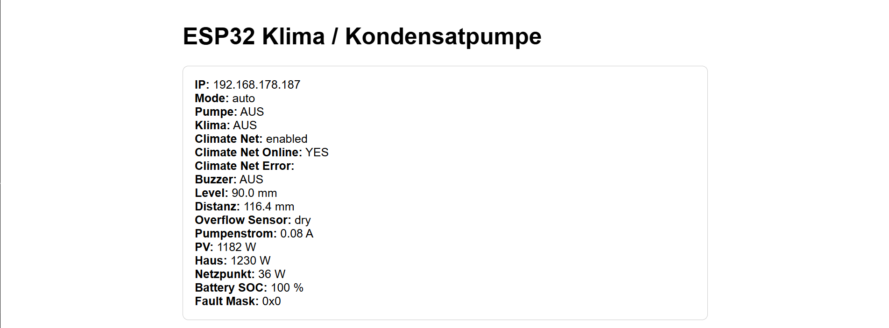
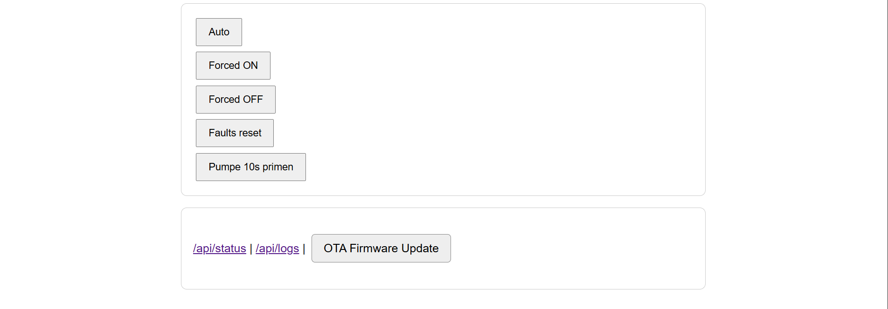
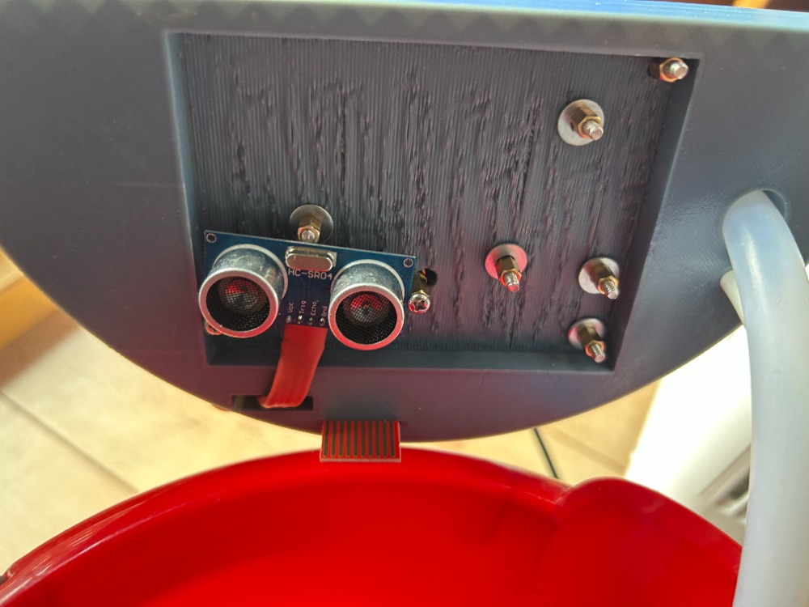
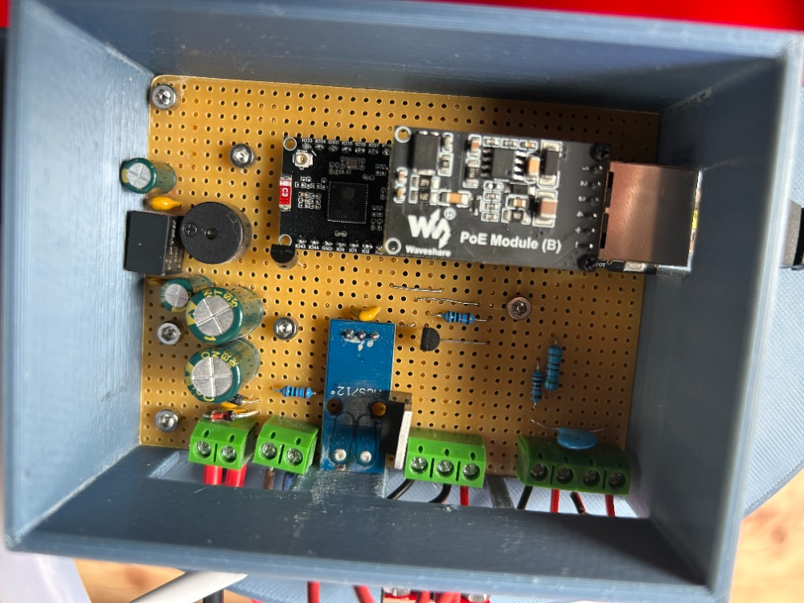
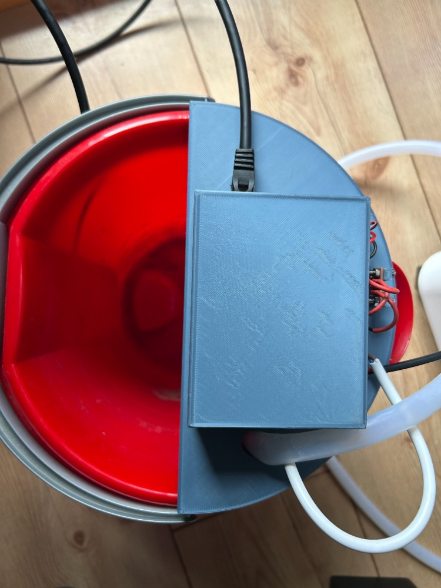

### Disclaimer

This project documentation was prepared with the help of **ChatGPT**.

---

# ClimateCondensateGuard

**ClimateCondensateGuard** is an ESP32-S3 based condensate pump and air conditioner safety controller.

It monitors the water level of a condensate container, automatically controls a 12 V pump, detects pump faults, and can enable or disable an air conditioner depending on available solar energy.

The system is designed for a mobile air conditioner setup where condensate water must be pumped away safely.

---

## Features

- Water level monitoring using an ultrasonic sensor
- Redundant overflow detection using a water sensor
- Automatic 12 V pump control via MOSFET
- Pump current monitoring using a Hall current sensor
- Fault detection for:
  - Overflow condition
  - Pump commanded but no current detected
  - Pump running but water level not falling
  - Invalid ultrasonic readings
  - Energy system communication failure
- Ethernet network connection using the Waveshare ESP32-S3 ETH board
- Web interface for status, logs, fault reset, and pump priming
- HTTP API for automation and external control
- Climate control through a local HTTP bridge
- E3/DC Modbus TCP energy monitoring
- OTA firmware update through the web interface
- FreeRTOS based task structure
- Modular modern C++ code structure

---

## Images

### Web Interface

### Hardware Setup

---

## Hardware

Main components used in this project:

- Waveshare ESP32-S3 ETH Development Board
- HC-SR04 ultrasonic distance sensor
- Redundant PCB water sensor
- 12 V condensate pump
- MOSFET pump driver
- Hall current sensor
- Buzzer
- External 12 V supply for the pump
- E3/DC energy system using Modbus TCP
- Comfee / Midea based mobile air conditioner controlled through a local HTTP bridge

---

## Basic Operation

The ultrasonic sensor measures the distance from the top of the container to the water surface.

The firmware converts this distance into a water level.

When the configured upper water level is reached, the pump is started.

When the water level falls below the configured lower threshold, the pump is stopped.

A redundant water sensor is used as an emergency overflow detector.

If this sensor becomes wet, the system disables the air conditioner and activates the buzzer.

The pump is monitored by a Hall current sensor.

If the pump is enabled but no current is detected, a fault is triggered.

If current is detected but the water level does not fall within the configured time window, another fault is triggered.

Critical faults disable the air conditioner and activate the buzzer.

---

## Climate Control

The air conditioner is controlled through a local HTTP bridge running in the same network.

The ESP32 sends HTTP requests to the bridge, for example:

~~~http
POST /api/climate/power
~~~

The bridge then controls the air conditioner locally.

In automatic mode, the air conditioner is only enabled when enough solar surplus energy is available according to the E3/DC Modbus TCP data.

Manual override modes are also available:

- `auto`
- `forced_on`
- `forced_off`

---

## Web Interface and API

The ESP32 provides a local web interface over Ethernet.

Common endpoints:

~~~text
/
~~~

Main dashboard.

~~~text
/api/status
~~~

Returns current system status as JSON.

~~~text
/api/logs
~~~

Returns recent log entries.

~~~text
/api/mode?value=auto
/api/mode?value=forced_on
/api/mode?value=forced_off
~~~

Changes the operating mode.

~~~text
/api/reset-faults
~~~

Clears latched pump faults if the overflow sensor is dry.

~~~text
/api/pump/prime?seconds=10
~~~

Runs the pump manually for a short test period.

~~~text
/ota
~~~

Web-based OTA firmware update page.

---

## OTA Update

Firmware can be updated over the local web interface.

After building the project with PlatformIO, upload the generated firmware binary:

~~~text
.pio/build/waveshare_esp32_s3_eth/firmware.bin
~~~

through the `/ota` page.

Only upload firmware that was built for the correct ESP32-S3 board and partition layout.

---

## Configuration

Important configuration values are located in the project configuration files.

Examples include:

- Ethernet pin configuration
- Ultrasonic sensor trigger and echo pins
- Pump MOSFET gate pin
- Water sensor pin
- Hall current sensor ADC pin
- Tank height and pump thresholds
- E3/DC Modbus TCP IP address
- Climate HTTP bridge URL
- OTA credentials

Before using the system, all hardware pins and threshold values must be checked and adapted to the actual setup.

---

## Safety Notes

This project controls water handling equipment and indirectly controls an air conditioner.

Use this project at your own risk.

Important safety considerations:

- The ESP32 GPIOs are 3.3 V only.
- The HC-SR04 echo signal must be level-shifted before connecting it to the ESP32.
- The pump must be driven through a suitable MOSFET or driver circuit.
- A flyback diode or suitable suppression should be used for inductive loads.
- The water sensor and pump system should be tested thoroughly before unattended operation.
- This project is not a certified safety device.
- Do not rely on this system as the only protection against water damage.
- Always design the container and drain system so that a failure does not immediately cause damage.
- Keep mains voltage wiring fully separated from low-voltage electronics.
